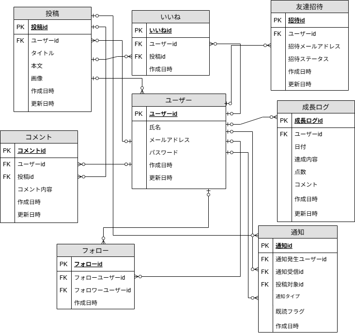

#  GrowCake

## サイトテーマ
筋トレの継続をケーキの成長として可視化し、楽しく努力を続けられるモチベーションSNSサイト

## 利用方法
1．ユーザー登録　or　ゲストログイン
2．運動ログを登録・編集・削除
3．マイページで履歴確認

## 機能一覧
・ユーザー登録/ログイン/ログアウト
・ゲストログイン
・運動ログCRUD
・バリデーション
・レイアウト調整(Bootstrap使用)
​
### テーマを選んだ理由
私はこれまで、モチベーションの波に左右されることがあり、努力を継続するための工夫が必要だと感じていました   
そこで、頑張る過程をもっと楽しく感じられるように「成長を可視化する」仕組みを考えました  
ケーキが少しずつ完成していく演出を取り入れることで、達成感を日々感じられるアプリを目指しています  

​
## ターゲットユーザ
・習慣化や学習の継続が苦手な人  
・日々の努力を可視化して達成感を感じたい人  
・見た目の変化でモチベーションを保ちたい人  
​
## 主な利用シーン
・毎日の筋トレ達成をチェックするとき  
・継続の成果を視覚的に実感したいとき  
・SNSで「今日のケーキ」を共有したいとき  
​
## ER図

 
​
## 開発環境
・OS：Ubuntu(またはLinux)  
・言語：HTML/CSS/JavaScript/Ruby/SQL  
・フレームワーク：Ruby on Rails  
・JSライブラリ  
・IDE：Visual　Studio　Code  

## 使用素材
・デザイン素材：イラストAC(https://www.ac-illust.com/)  

## 今後の実装予定
・いいね機能
・コメント機能
・フォロー機能
・通知機能